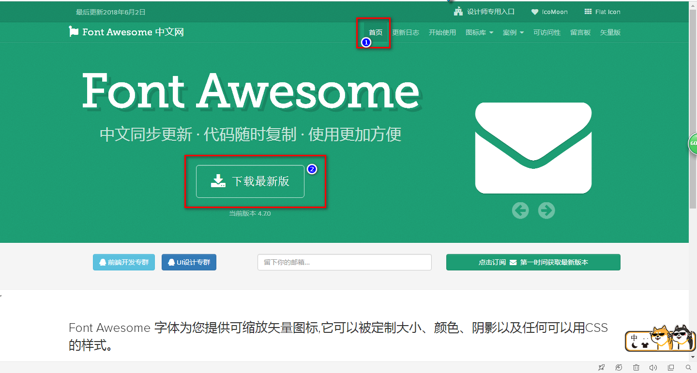
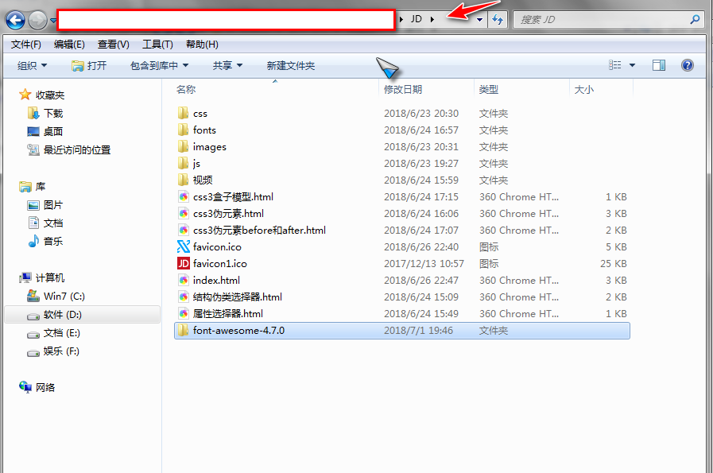
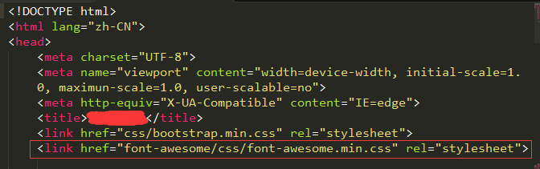

# font-Awesome使用指南 #
对font-awesome的理解：

font-awesome和很多其他矢量字体图标一样，可以用在各响应式和移动端网站上。它和bootstrap的Glyphicons 字体图标组件性质类似，在图标数量上优于Glyphicons字体。

如何导入font-awesome字体到本地工程：

1.在官网首页下载font-awesome字体包到本地，官网地址：[http://www.fontawesome.com.cn/](http://www.fontawesome.com.cn/)

2.把下载下来的字体包解压，**并把文件夹复制到本地工程根目录**。如图为文件结构（下载压缩文件内包括压缩后的css文件和源码css文件，在工程内可使用压缩处理过的css文件）：
比如我的工程名字叫做JD,那就放在idt文件下:和index.html文件同级

3.在界面内引入样式文件，link内文件地址为文件的相对地址，如图：

4.使用规则和代码：

可以用i标签和span标签引用字体，在html标签语义上，span标签更符合使用语义。使用时，先给元素加上“.fa”的基础字体样式，然后加上“.fa-想要使用的图标名称”。字体可按倍数缩放，具体规则请参考官网说明。用户可自行设定颜：色大小等属性，同一般的字体属性设置。以使用heart这个字体图标为例：

基础引用： 或<i class="fa fa-heart"></i>

放大图标：（倍数放大用fa-数字+x）

设置属性：如定义了红色字体为：font-red，12号字体大小为f12，则应用到此图标上可以写成

还有其他问题可以访问：http://fontawesome.dashgame.com/#basic 进行更详细的学习。
