# JavaScript基础 #
1.什么情况下是undifind:变量声明了,但是没有定义.
如果一个undifind的数和一个数字进行计算,结果是:NaN,即not a number,不是一个数字,也没有什么意义.

	isNaN()			// 意思是:括号中的数字   是不是  不是  一个数字  ?
	isNaN(10)     	// 结果:false 

2.如何获取一个变量的数据类型?

(1) 使用typeof 获取变量的类型:

	1.typeof 变量名 
	2.typeof(变量名)

	var numb=10;
	console.log(typeof numb); // number

(2) js中的进制!
	
	var num=10;			// 十进制
	var num=012;		//八进制
	var num=0X123		//十六进制

(3) 数字范围类型有范围

	console.log(Number.MAX_VALUE);	//数字的最大值

**不要用小数去验证小数,其中有个bug**

(4) **伪数组:**  `arguments`

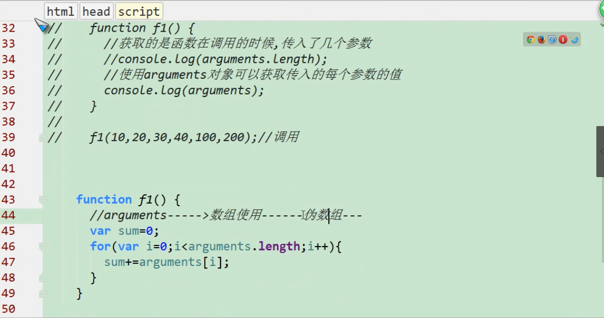

function f1(){
	coneole.log('xxxxxx')
}
	f1()					// f1指的是函数名,存储的是f1中的所有代码,
比如:console.log(f1)		

结果是: 

	f f1(){
	coneole.log('xxxxxx')
	 }

# 匿名函数 #

## 匿名函数不能直接调用 ##
	
	var f2=function (){					//函数表达式 
		console.log("xxxxxx");
	};
	
**将匿名函数直接赋值给f2了,解决了匿名函数不能直接用的问题!**	

匿名函数的调用:

	f2();  

特殊:f1()  小括号前是函数的代码;

## f1()  同理想到---->      (函数代码)()   ----->(function(){console.log("xxxx")};)() ##

## 函数的自调用(只能使用一次): ##

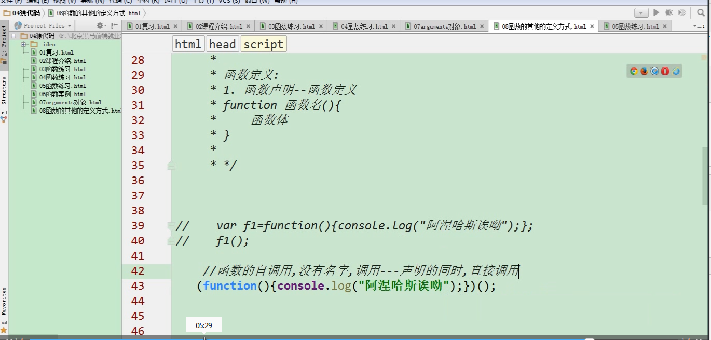

把一个函数给一个变量,此时形成了一个函数表达式!		--> var 变量=匿名函数
*注意:*函数表达式后面赋值结束后,一定要有分号 !

函数名();  // 函数的调用

# 回调函数 #

**函数可以作为参数使用,如果一个函数作为参数,那么,我们说这个参数(函数)可以叫做, 回调函数;
只要看到一个函数作为参数使用了,那就是回调函数!** 

**1.js没有块级作用域(函数除外);**
**2.隐式全局变量:没有用var声明的变量,叫做隐式全局变量.**

	function f1(){
		num=100;// 这是个隐式全局变量,外面也可以访问
	}
**3.全局变量是不能被删除的,隐式全局变量是可以被删除的,定义变量使用var是不会被删除的,没有var是可以删除的.**
**4.函数调用之前,会把函数的声明提升到这个函数作用域的上面, **

## 预解析 ##
js解析器在执行js代码的时候,分为两个过程,预解析过程和执行过程.

1. 把变量的声明提升到当前作用域的最前面,只会提升声明,不会提升赋值;
2. 把函数的声明提升到当前作用域的最前面,只会提升声明,不会提升调用;
3. 先提升var,在提升function;

预解析中,变量的提升只会在当前的作用域中提升,提前在当前的作用域的最上面,函数中的变量只会提升到函数的作用域的最前面,不会出去.

	f1();	// 调用 -->函数调用之前,会把函数的声明提升到这个函数作用域的上面
	var num=20;	//这个变量的声明会提升到变量的使用之前.---->也就是说声明在前,赋值在后(预解析).
	function f1() {
		console.log(num)
		var num =10;
	};
	
面向过程:凡事都要其力亲为,每件事情的具体过程都要知道,**注重的是过程**.(单身)
面向对象:根据需求找对象,所有的事情都要对象来做,**注重的是结果**.(对象)

创建一个对象:

	var obj=new Object();		//Object是系统的构造函数
	obj.name=gankai;		//直接可以声明属性
	obj.say=function (){console.log("xxxx");};  //直接声明方法,匿名的.
	obj.say();
	
函数和构造函数的区别:构造函数的名字首字母是大写的,普通函数不是;

# 自定义构造函数 #

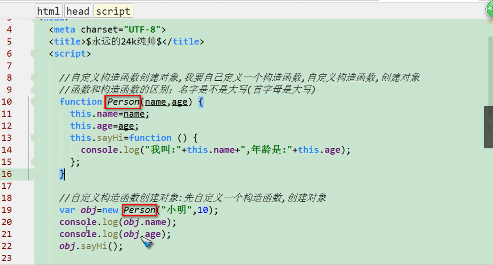

	var Person(name, age){		// 构造函数
		this.name=name;
		this.age=age;
		this.play=function () {
			console.log("xxxxx");
		};
	}

	var per=new Person("张三",29);
创建一个对象,实例化一个对象,并且初始化,
 	var  per =new Person("小米",20);
做了四件事:
	
1. 在内存中开辟了空间,存储了新的对象,
2. 把this设置为当前对象,
3. 设置对象的属性和方法值,
4. 返回创建后的新对象

可以用 obj instanceof Person  来判断对象的所属类型

用字面量形式创建对象,
	
	var obj={};				// 缺点是:一次性使用!

另一种方式设置和获取对象的属性和方法

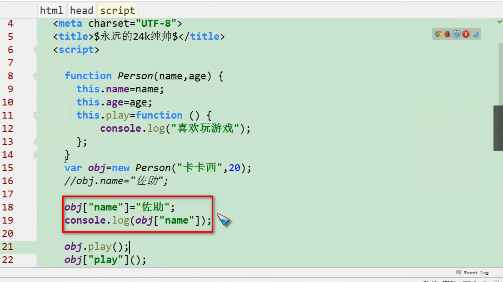

## 如何变量对象? ##

变量对象,不能通过for循环来变量,对象是无序的.
	下面中,key是一个变量,这个变量中存储的是该对象的所有的属性的名字,
	for(var key in obj){
		console.log(obj[key]);		//输出所有对象的属性的名字
	};
	
**值类型传递的数据是值传递 引用类型传递的是地址**

## js学习中的三种对象 ##

1. 内置对象;--------js系统自带的对象
2. 自定义对象;------自己定义的
3. 浏览器对象

参考MDN 离线文档

[https://developer.mozilla.org/zh-CN/](https://developer.mozilla.org/zh-CN/ "MDN文档离线手册")

字符串的不可变性

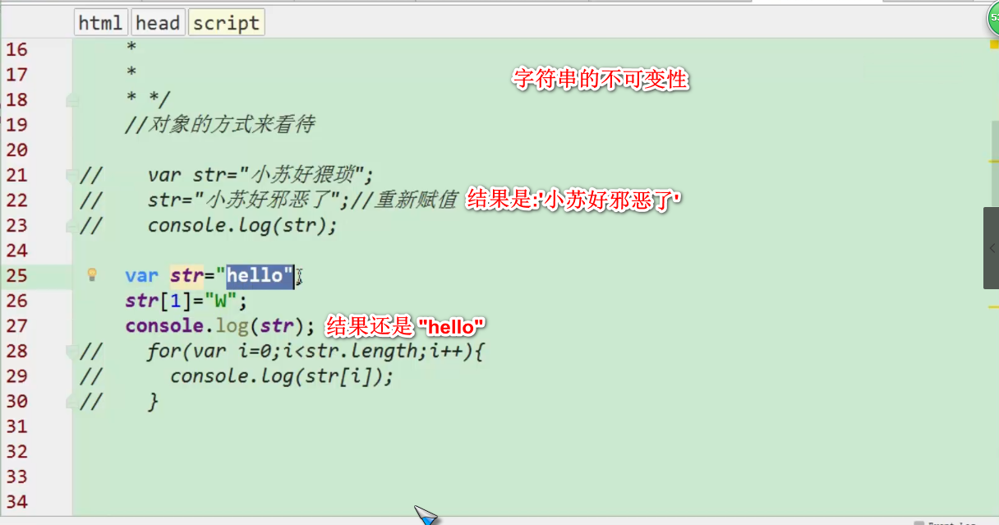

原因是:str的指向发生了改变,只有一个str!

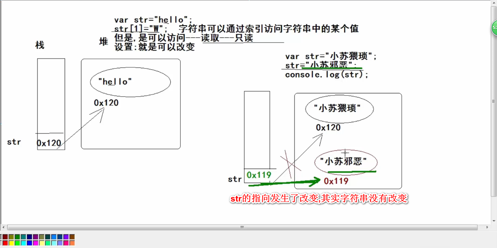 

## 数组的几个要记住的方法 ##
 
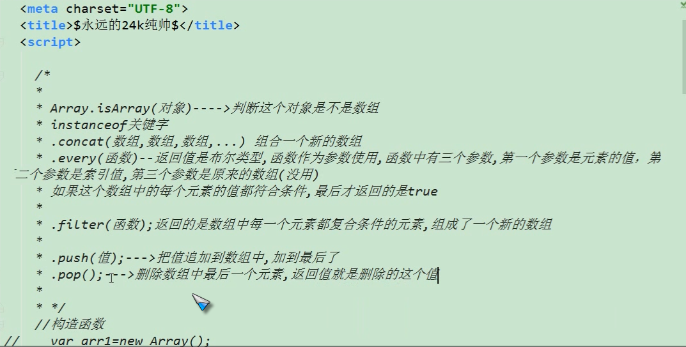

1. .push(值);--->把值追加到数组中,所追加的数放到最后,返回值是追加之后的数组的长度,
2. .pop();------>删除数组中的最后一个元素,返回值就是删除的这个元素的值;
3. .shift();---->删除数组中的第一个元素,返回值就是删除的这个元素的值;
4. .unshift();-->向数组的第一个元素的前面插入一个新的元素,返回值是插入之后的数组的长度;
5. .map(函数);--->数组中的每个元素都要执行这个函数,把执行后的结果重新全部的放在一个新的数组中返回

## 基本包装类 ##
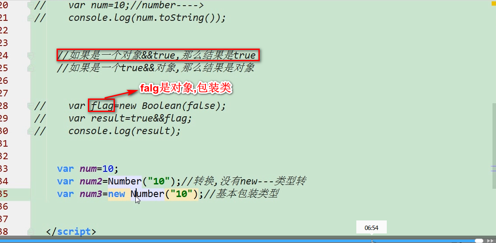

**一个需要注意的问题:函数f加不加括号的问题**

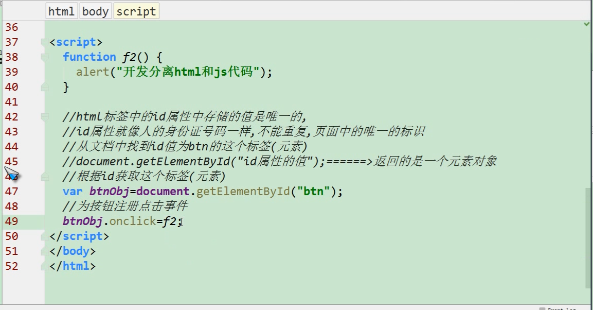

图中,f2后面没有加(),是将f2的代码放在onclick中让onclick去执行,如果是f2(),则是f2自己这个函数去执行,直接执行了.

for循环是在页面加载的时候执行的,事件是在触发的时候执行的!

**disabled====>禁用的;readonly======>只读的**

对于网页的开关灯,给body标签设置添加一个class属性的style样式为black就行了,而且,document.body可以直接获得body对象;

----------
## 阻止超链接默认跳转的几种方法 ##

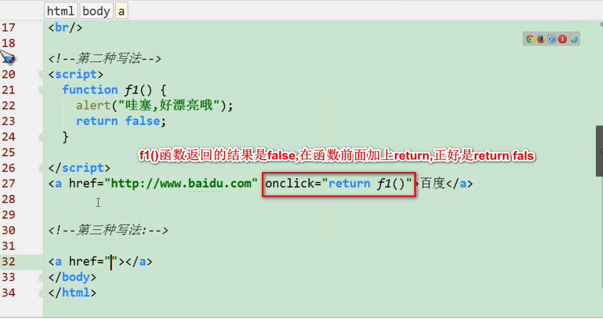

第三种写法
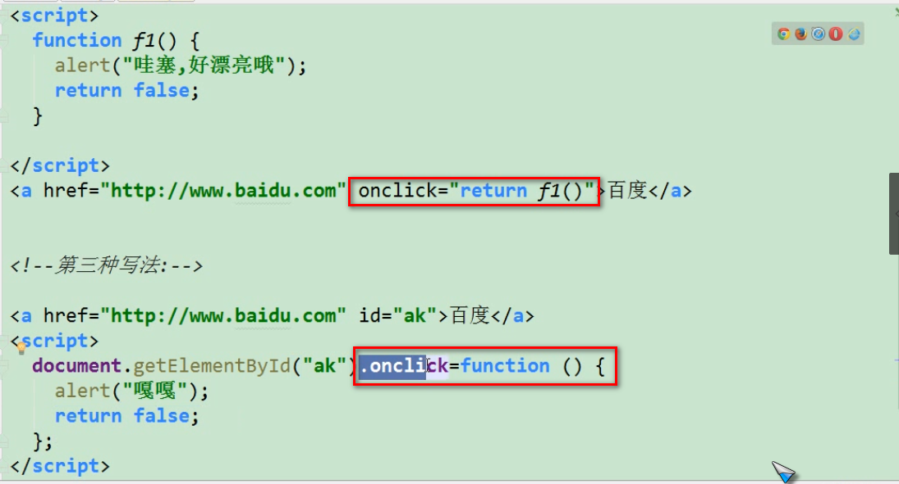

**区别是第三种方法是将代码直接给onclick事件,第二种方法是onclick事件去执行f1函数**

## 获取元素的方式 ##
1. 根据ID属性获取元素,返回来的是一个对象,
	document.getElementById("id")
2. 根据标签名字获取元素,返回来的是一个数组,里面保存了多个DOM对象
	document.getElementById("标签名字")
3. 根据name属性的值获取元素,返回来的是一个伪数组,里面保存了多个DOM的对象,
 document.getElementByName("name的属性值")
4. 根据class 的样式名字来获取元素,返回来的是一个伪数组,里面保存了多个DOM的对象,
	document.getElementByClassName("类名")
5. 根据选择器获取元素,返回来的是一个元素对象.
	document.querySelect("选择器的名字比如:#id")
6. 根据选择去获取元素,返回来的是一个伪数组,里面保存了多个DOM对象,

**如果一个属性在浏览器中不支持,那么这个属性的类型就是undefined**

## 如何判断浏览器的兼容性? ##
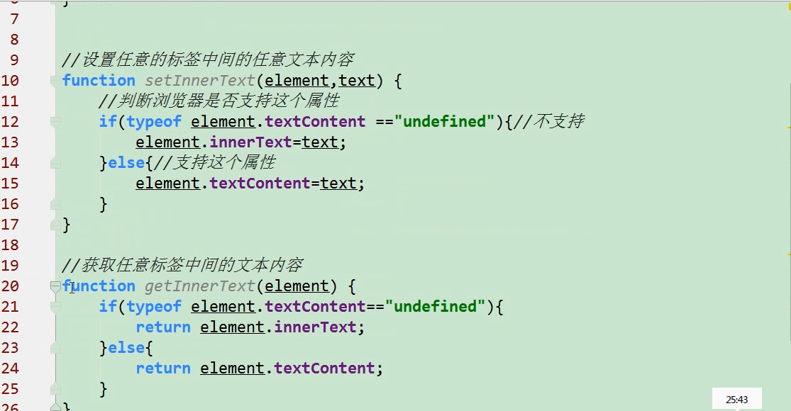

在脚本`<script>`标签中定义这个方法,就可以直接用了! 

## 如何给标签设置自定义属性? ##

在html标签中,添加的自定义的属性,如果想要获取这个属性的值,需要使用getAttribute("自定义属性的名字"),才能获取到这个属性的值.

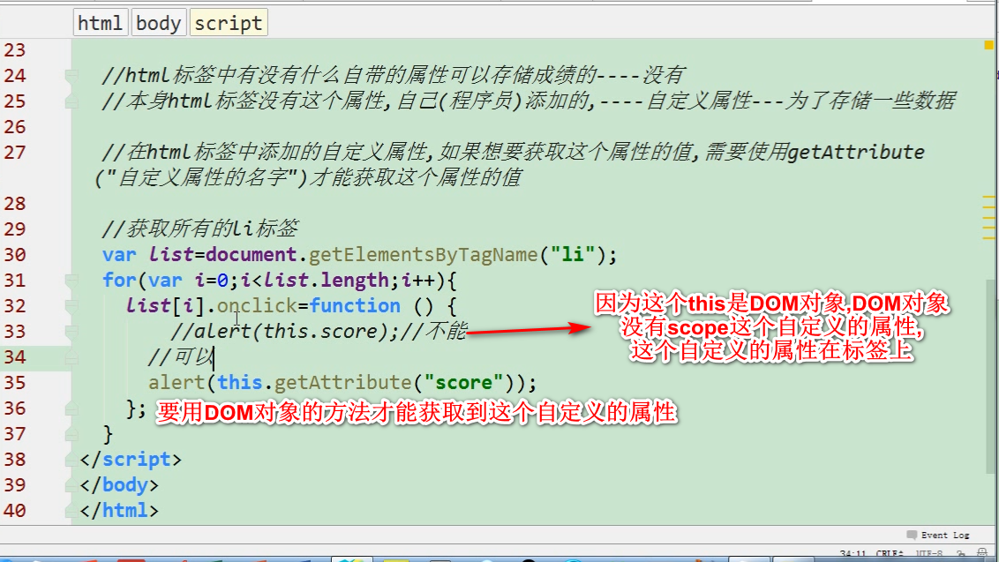

**设置自定义属性:**

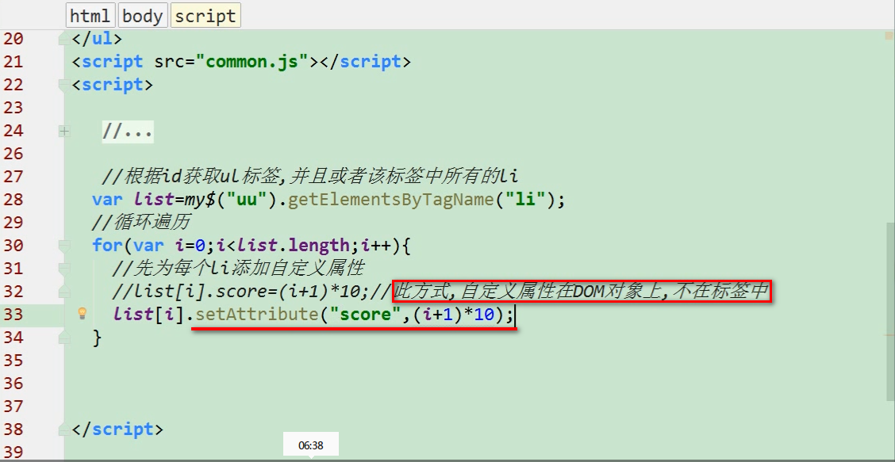

**移出某个标签的自定义的属性 removeAttribute('scope')**

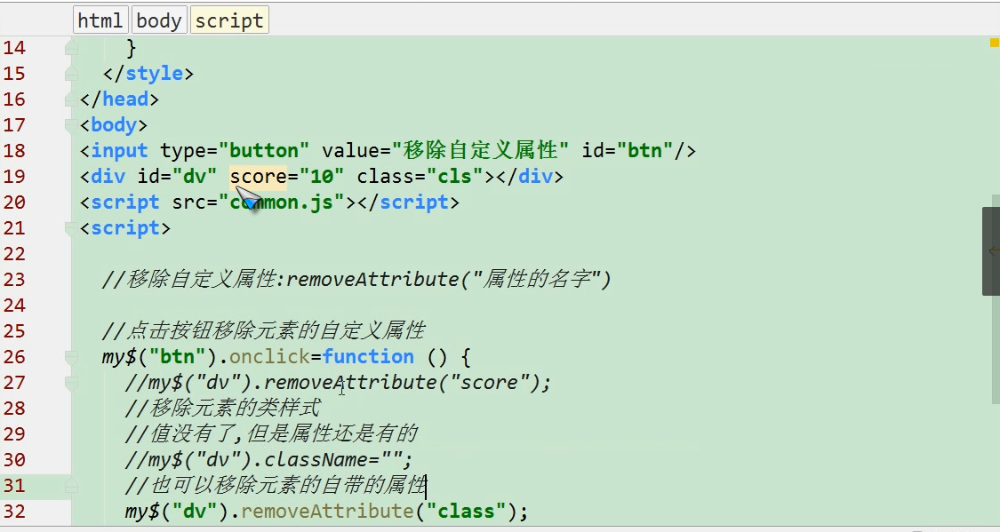

**tab切换模块=======>原理是排他性**  

思路:

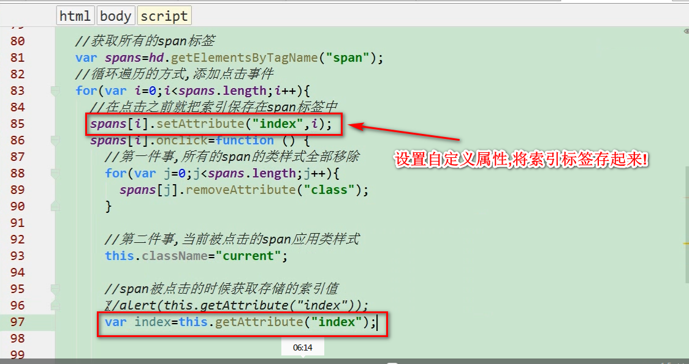
      
**根据上面tab的index索引,下面的对应的div改变颜色!**

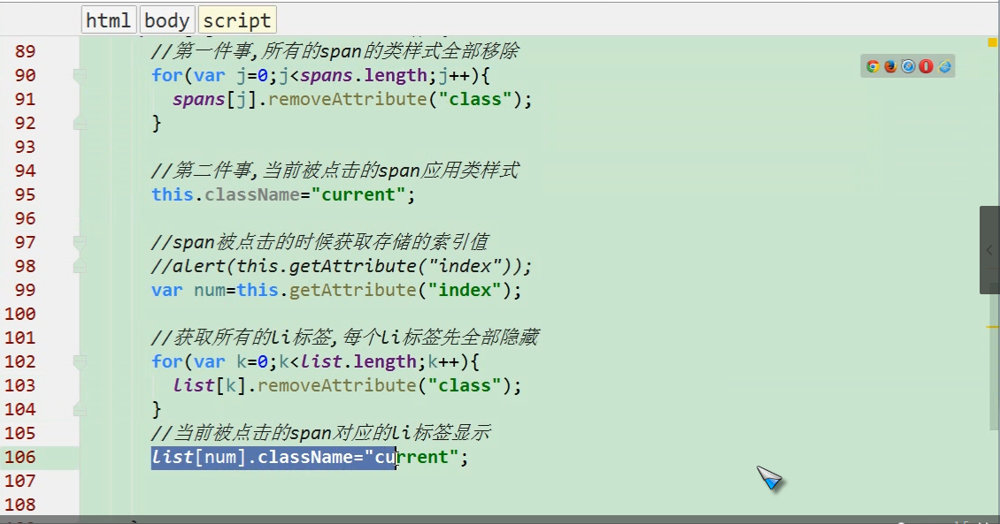

# 什么是节点(node) #

答案是:标签,属性 ,文本(文字 空格 换行 )

概念:
文档:document
元素:页面中的所有标签,元素
节点:页面中的所有内容(标签,属性,文本(文字,空格,回车换行))
根元素:html标签

**节点的属性**

1. 可以使用标签元素点出来,属性节点点出来,
2. nodetype,节点的类型,1-->节点,2--->属性,3--->文本
3. nodename,节点的名字,标签节点--->大写的标签名字,属性节点--->小写的属性名字,文本节点---->#text
4. nodevalue,节点的值:标签节点---null,属性节点---属性值,文本节点---文本内容.

**单复选框的全选和单选**

思路:

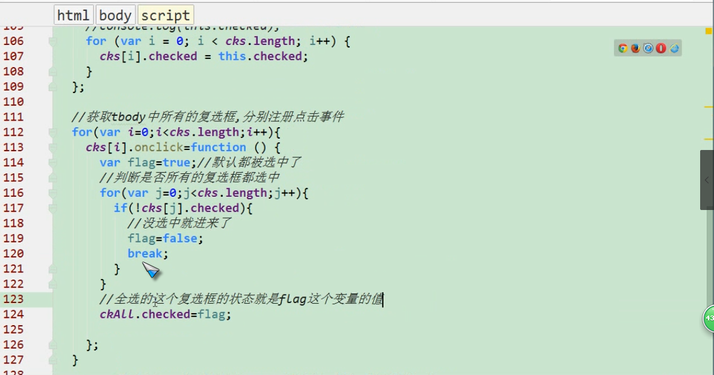

元素创建的三种方式:
1. document.write("标签的代码内容")------>会覆盖页面上的所有内容.
2. 对象.innerHTML='标签及代码';document.body.innerHTML="
这是一个p标签
"
3. document.createElement();

用原生DOM,注册一个鼠标点击事件,document.getElementById("标签的Id").onclick=function(){写鼠标点击后的代码}

**如果是循环的方式添加事件,循环中的函数,推荐用命名函数,如果不是循环的方式添加事件,推荐用匿名函数.****也就是说,循环中,最好是用命名函数比较好,这样可以节省空间.

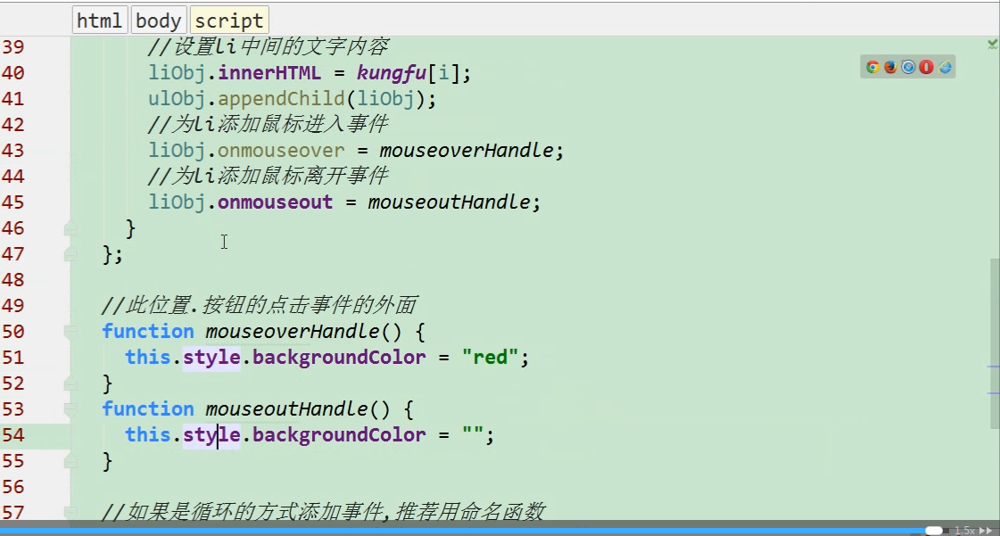

**百度新闻免费代码**

*标签的css样式和DOM的css样式*

图中的tableObj.border='1',是标签自带的border,给标签添加css属性,这样整个table标签中的tr 和td都有border属性,但是如若是tableObj.style.border='1px solid red' 这样是DOM属性,只有table有属性,table中的tr和td没有border属性.

点击一次只创建一个按钮!
**思路1:有则删除,无则创建** 

看一下区别:
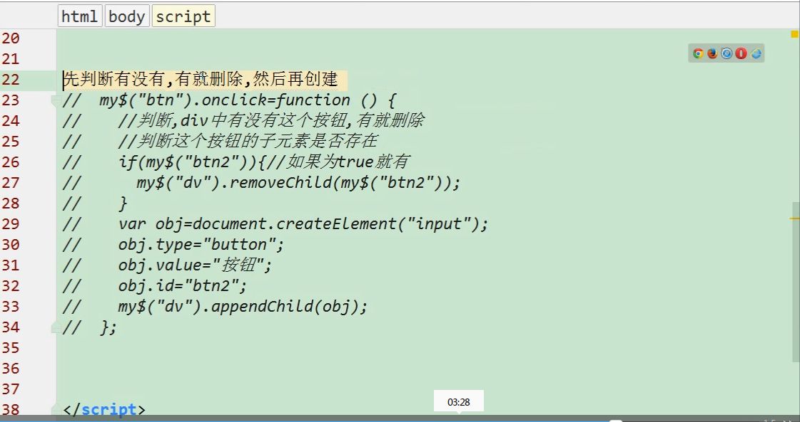

这样的创建是,边创建,边删除(效率不是太好).

**思路2:不存在,就创建,存在就维持原样,不做任何操作**

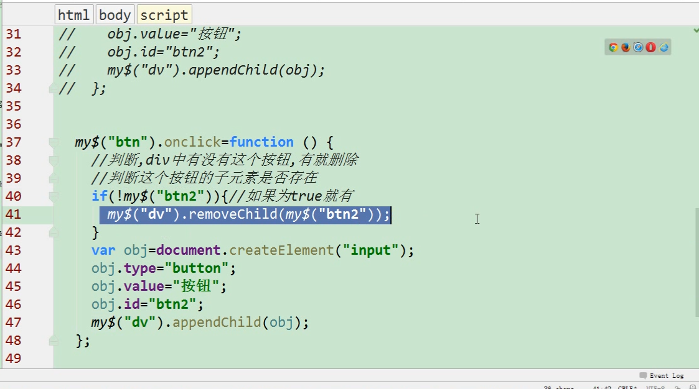

# 如何为一个元素标签绑定多个事件? #

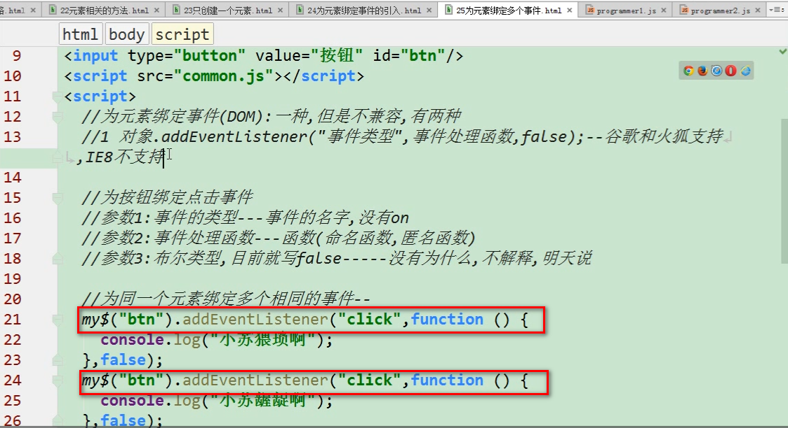

注意:对于IE8,可以用这个对象.attachEvent("有on的事件类型",事件处理函数),这个只有IE8支持

## 为任意元素,绑定任意事件##

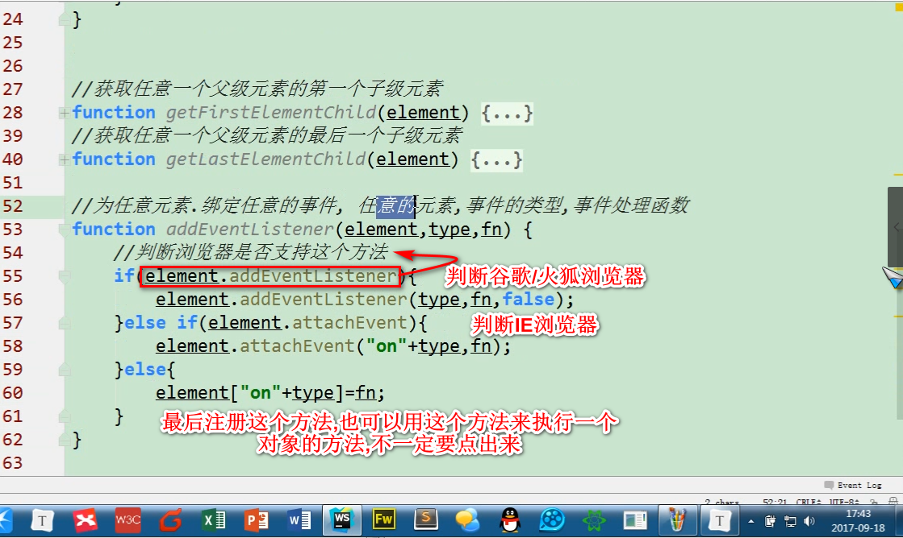

**方法和函数的区别:**方法需要通过对象点才能调用执行(对象.sayHi();),函数可以直接使用(sayHello();)

*一句话,方法是有人调,函数是没有人调.*

# 为对象添加多个点击事件 #

## 绑定事件的区别 ##

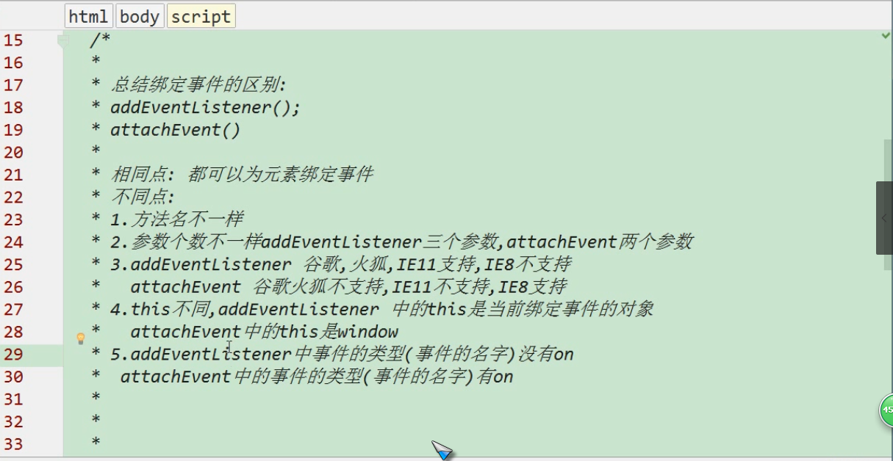
