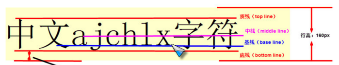
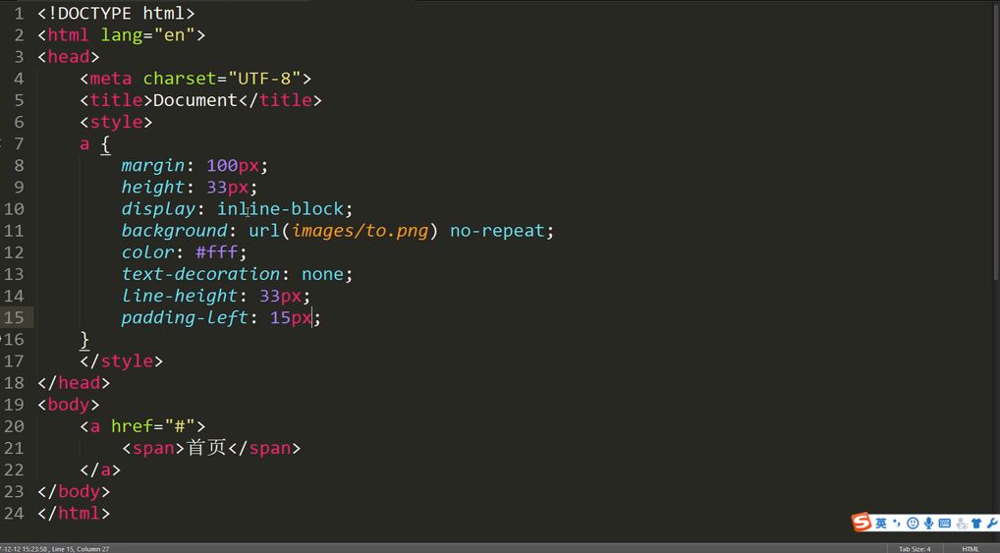
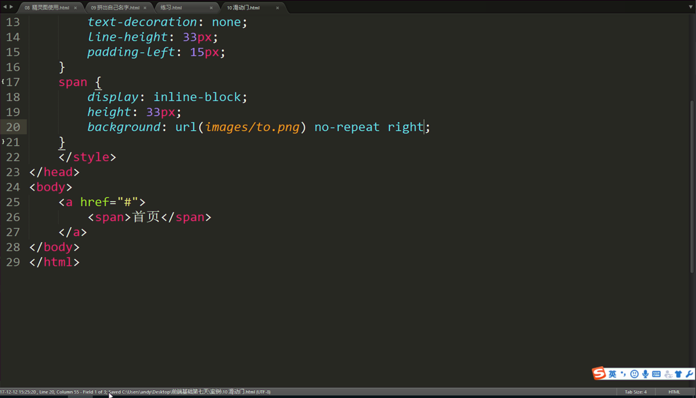
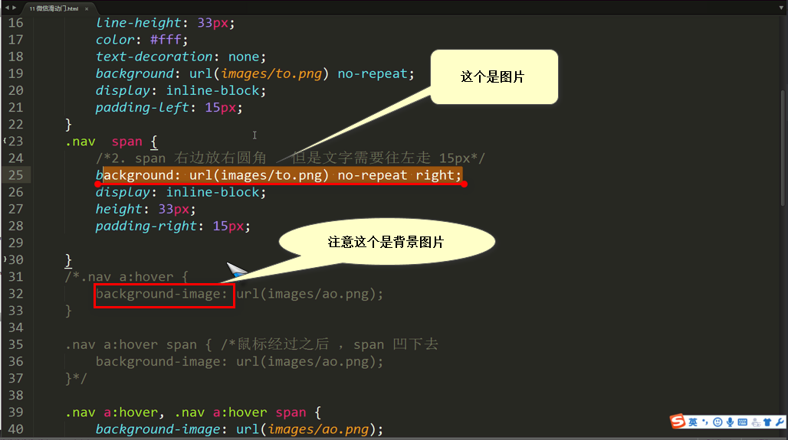
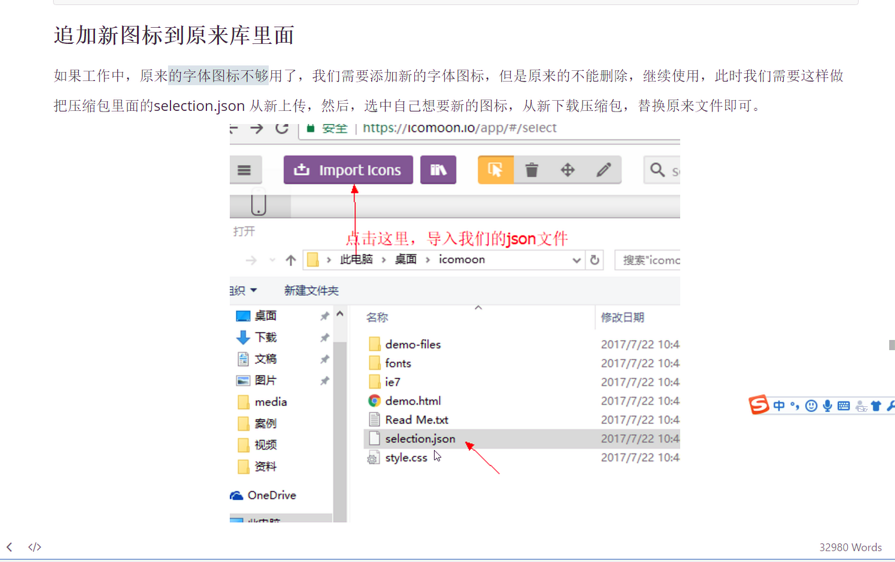
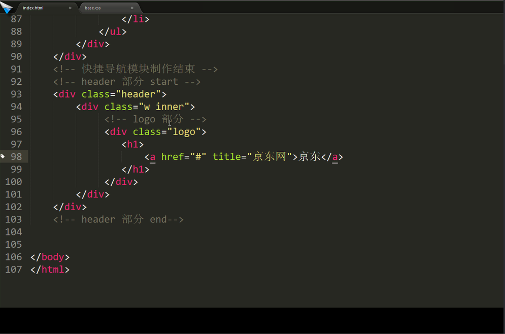
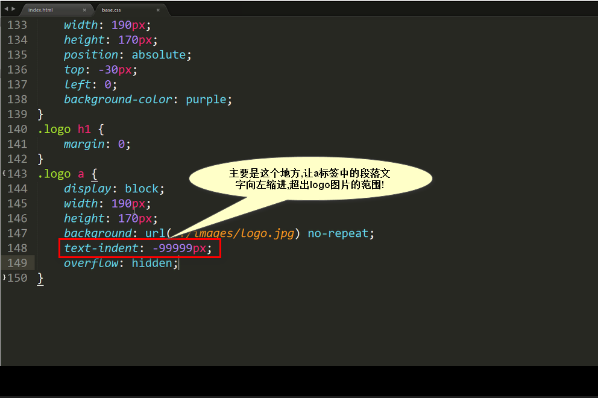
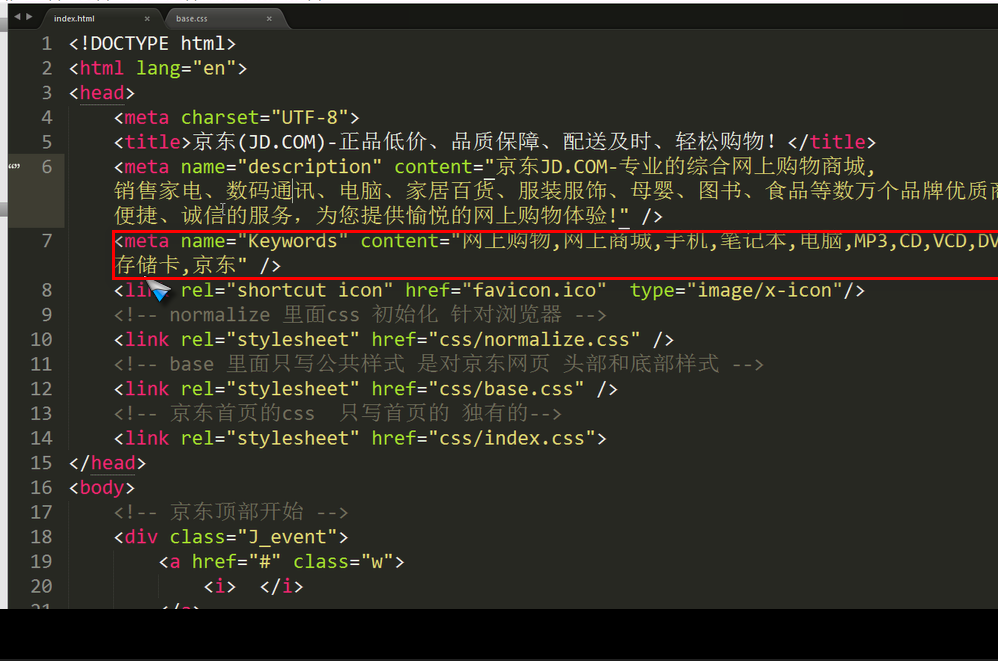
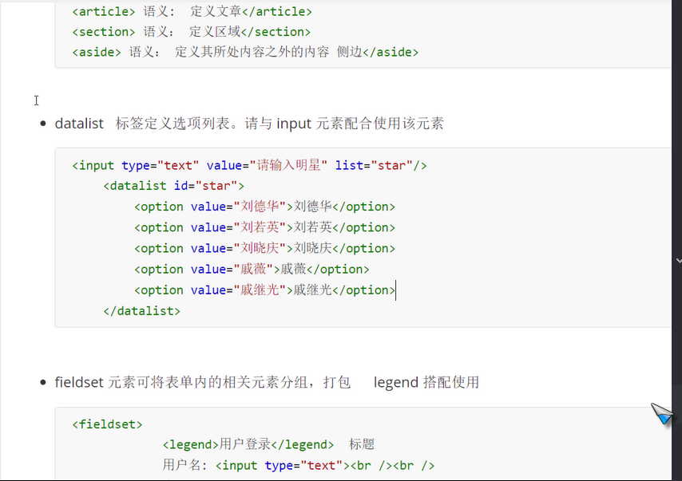
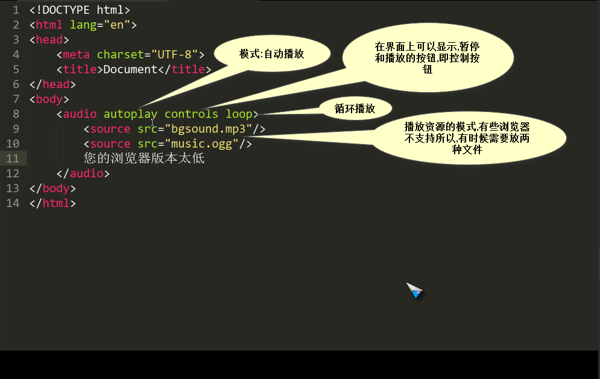

# The-study-of-VUE.js
#splice(数组)
 + 用法：array.slice(startindex,endindex)
 + startindex开始位置的索引,结束位置的索引
 + 截取字符串,含头不含尾
 + 如果不传入参数二，那么将从参数一的索引位置开始截取，一直到数组尾

`
var a=[1,2,3,4,5,6];
var b=a.slice(0,3);    //[1,2,3]
var c=a.slice(3);       //[4,5,6]
`

 如果两个参数中的任何一个是负数，array.length会和它们相加，试图让它们成为非负数，举例说明：
 当只传入一个参数，且是负数时，length会与参数相加，然后再截取

`var a=[1,2,3,4,5,6];
var b=a.slice(-1);    //[6] `

当只传入一个参数，是负数时,并且参数的绝对值大于数组length时，会截取整个数组	

`
var a=[1,2,3,4,5,6];
var b=a.slice(-6);    //[1,2,3,4,5,6]
var c=a.slice(-8);    //[1,2,3,4,5,6]
`

//当传入两个参数一正一负时，length也会先于负数相加后，再截取

`
var a=[1,2,3,4,5,6];
var b=a.slice(2,-3);    //[3]

`
//当传入一个参数，大于length时，将返回一个空数组

`
var a=[1,2,3,4,5,6];
var b=a.slice(6);　　//[]`
#splice(字符串)
- 举个简单的例子

`
var a="i am a boy";
var b=a.slice(0,6);    //"i am a" 
`
#splice(数组)
 + 用法：array.splice(start,deleteCount,item...)

解释：splice方法从array中移除一个或多个数组，并用新的item替换它们。参数start是从数组array中移除元素的开始位置。参数deleteCount是要移除的元素的个数。如果有额外的参数，那么item会插入到被移除元素的位置上。**它返回一个包含被移除元素的数组**。

举一个简单的例子

`var a=['a','b','c'];
var b=a.splice(1,1,'e','f');    //a=['a','e','f','c'],b=['b']`
#slice  ：
　　  定义：接收一个或两个参数，它可以创建一个由当前数组中的一项或多项组成的新数组，**注意是新数组哦~ 也就是说它不会修改原来数组的值。**

　　　　　用法：slice( para1 ),会截取从para1开始的到原数组最后的部分；

　　　　　　　　slice（para1,para2）会截取原数组的从para1开始的para2-para1个数组。 

　　　　**注意**：当两个参数中存在负数时，用原数组的长度加上两个负数的参数作为相应的参数来计算。

#总结

#split（字符串）

+ 用法：string.split(separator,limit)

解释：split方法把这个string分割成片段来创建一个**字符串数组**。可选参数limit可以限制被分割的片段数量。separator参数可以是一个字符串或一个正则表达式。如果

separator是一个空字符，会返回一个单字符的数组。

//再举一个简单的例子

`
var a="0123456";
var b=a.split("",3);    //b=["0","1","2"]
`
从空格所在的索引位置开始截取,截取3个	

 例如 ： str = “s-aaa-sss-eee-www”;

`targetArr = str.slite(“-”);	结果是 :[‘s’,’aaa’,’sss’,’eee’,’www’]`

2018-6-21 22:14:04

# 清除浮动的目的是为了解决父级元素因为子级元素浮动引起的高度为零的问题 #

四种定位的问题:定位一定要有宽和高,而且要写在宽和高前面

背景图片代码

`background:rgba(0,0,0,.4) url(imgs/xx.png) no-repeat center;`

##鼠标放上去 a里面的 mask显示出来

	vertical-aline 垂直对齐方式

图片默认是基线对齐行,内标签,

   有三种方式 基线:`vertical-aline:baseline;` 底线(bottom):居中(center)和顶部(top)

	注意,这个标签是加在img标签上的

什么是文字的基线?

2018-6-22 22:55:03

## 滑动门的a标签 ##

   

在a标签中添加滑动门事件,**主要的原理是控制背景图片的来回切换**

当鼠标移动上去的时候 ,图片变成凹下去的,这个凹下去的图片是用background-img做的 如图:

# 字体图标网址: [https://icomoon.io/](https://icomoon.io/)  #

在样式上中添加代码:

 		
	

## 如何自创独一无二的字体图标? 

 在https://icomoon.io/官网上,有个导入的按钮,你只需要把后缀名字为xxx.svg发文件导入,就行,就会自定生成一个你自己的字体图标,点击就可以下载.这个.svg文件一般是美工做好的.

#如何在自己的原来的字体图标的基础上追加字体图标? #

上传文件后,再次点击既想要你添加的图标,然后下载到本地即可!

 	淘宝ico 图标 [https://www.taobao.com/favicon.ico](https://www.taobao.com/favicon.ico) 

## log优化的问题 ##

# 网页优化三大标签 SEO(搜索引擎优化)# 

1.<title>标签:首页标题:网站名(产品名)-网站介绍  例如:参考jd的title
2.<meta>标签:在百度上搜索京东的时候,显示的简单的介绍就是这个`name="description" content="xxx" `的内容,如下图:

**上下两个图是对应的关系(图中content的文字内容不一样,并非同一个页面,知道怎么回事就行)**

# Description-网站说明(百度28个中文56kb,谷歌35个中文70kb) #

# Keywords -网站关键字(6-8个左右) #

`name="keywords" content="xxx" `

2018-6-24 10:39:57

**H5标签定义选项列表-datalist**

可以输入也可以下拉,类似百度搜索

	`<input type="text" value="请输入" list="star">
		<datalist id="star">
			<option value="刘德华"></option>
			<option value="刘若英"></option>
			<option value="刘备"></option>
			<option value="刘晓庆"></option>
			<option value="戚继光"></option>
			<option value="常委"></option>
			<option value="长威"></option>
	</datalist> `

** fieldset标签 **

	<form action="">
		<input type="text" required accesskey="s">
		<input type="submit" value="添加">
	</form>

accesskey标签属性 ,默认按哪个键会自动将光标移动到输入框中去,一般是设置 alt+s 
自动获取光标,在标签上加属性 autofocus

# 插入视频 #

很简单只要在代码中插入 一个连接就行  例如:跑男的连接o(*￣︶￣*)o

`<iframe frameborder="0" width="640" height="498" src="https://v.qq.com/iframe/player.html?vid=q00266ydgmr&tiny=0&auto=0" allowfullscreen></iframe>`

# 播放背景音乐 audio#

	<audio  autoplay controls loops>
		<source src="视频/bgsound.mp3">背景音乐mp3
		<source src="视频/music.ogg">背景音乐ogg
		<source src="视频/music.Wav">背景音乐wav
		你的浏览器不支持HTML音频播放功能
	</audio>

一般播放音乐的文件有三种模式,即后缀名为 .MP3 .ogg .wav  ,有浏览器会不支持,如果都不支持则显示 `你的浏览器不支持HTML音频播放功能` 这句话!

# 播放视频 video #

格式有 `ogg, mpeg 4(MP4), webm` 这三个格式!

	<video autoplay controls >
		<source src="视频/mp4.mp4">
		<source src="视频/movie04.ogg">
	</video>

可以设置视频的高度和宽度,其他的属性和播放视频一样,不在重复赘述!