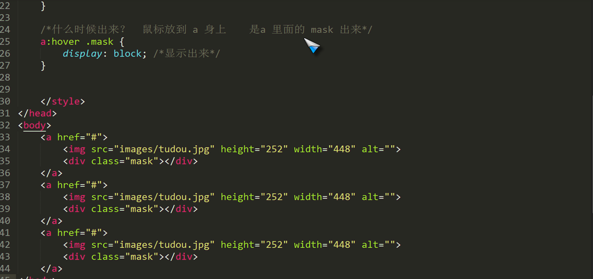

# The-study-of-VUE.js
#splice(数组)
 + 用法：array.slice(startindex,endindex)
 + startindex开始位置的索引,结束位置的索引
 + 截取字符串,含头不含尾
 + 如果不传入参数二，那么将从参数一的索引位置开始截取，一直到数组尾

`
var a=[1,2,3,4,5,6];
var b=a.slice(0,3);    //[1,2,3]
var c=a.slice(3);       //[4,5,6]
`

 如果两个参数中的任何一个是负数，array.length会和它们相加，试图让它们成为非负数，举例说明：
 当只传入一个参数，且是负数时，length会与参数相加，然后再截取

`var a=[1,2,3,4,5,6];
var b=a.slice(-1);    //[6] `

当只传入一个参数，是负数时,并且参数的绝对值大于数组length时，会截取整个数组	

`
var a=[1,2,3,4,5,6];
var b=a.slice(-6);    //[1,2,3,4,5,6]
var c=a.slice(-8);    //[1,2,3,4,5,6]
`

//当传入两个参数一正一负时，length也会先于负数相加后，再截取

`
var a=[1,2,3,4,5,6];
var b=a.slice(2,-3);    //[3]

`
//当传入一个参数，大于length时，将返回一个空数组

`
var a=[1,2,3,4,5,6];
var b=a.slice(6);　　//[]`
#splice(字符串)
- 举个简单的例子

`
var a="i am a boy";
var b=a.slice(0,6);    //"i am a" 
`
#splice(数组)
 + 用法：array.splice(start,deleteCount,item...)

解释：splice方法从array中移除一个或多个数组，并用新的item替换它们。参数start是从数组array中移除元素的开始位置。参数deleteCount是要移除的元素的个数。如果有额外的参数，那么item会插入到被移除元素的位置上。**它返回一个包含被移除元素的数组**。

举一个简单的例子

`var a=['a','b','c'];
var b=a.splice(1,1,'e','f');    //a=['a','e','f','c'],b=['b']`
#slice  ：
　　  定义：接收一个或两个参数，它可以创建一个由当前数组中的一项或多项组成的新数组，**注意是新数组哦~ 也就是说它不会修改原来数组的值。**

　　　　　用法：slice( para1 ),会截取从para1开始的到原数组最后的部分；

　　　　　　　　slice（para1,para2）会截取原数组的从para1开始的para2-para1个数组。 

　　　　**注意**：当两个参数中存在负数时，用原数组的长度加上两个负数的参数作为相应的参数来计算。

#总结

#split（字符串）

+ 用法：string.split(separator,limit)

解释：split方法把这个string分割成片段来创建一个**字符串数组**。可选参数limit可以限制被分割的片段数量。separator参数可以是一个字符串或一个正则表达式。如果

separator是一个空字符，会返回一个单字符的数组。

//再举一个简单的例子

`
var a="0123456";
var b=a.split("",3);    //b=["0","1","2"]
`
从空格所在的索引位置开始截取,截取3个	

 例如 ： str = “s-aaa-sss-eee-www”;

`targetArr = str.slite(“-”);	结果是 :[‘s’,’aaa’,’sss’,’eee’,’www’]`

2018-6-21 22:14:04

# 清除浮动的目的是为了解决父级元素因为子级元素浮动引起的高度为零的问题 #

四种定位的问题

背景图片代码

`background:rgba(0,0,0,.4) url(imgs/xx.png) no-repeat center;`

##鼠标放上去 a里面的 mask显示出来

##vertical-aline 垂直对齐方式

图片默认是基线对齐行,内标签,

   有三种方式 基线:`vertical-aline:baseline;` 底线(bottom):居中(center)和顶部(top)

	注意,这个标签是加在img标签上的

什么是文字的基线?
