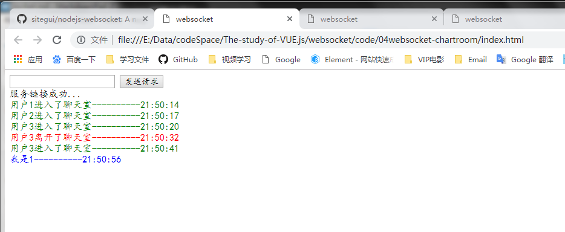

# demo演示

思考：这种网页版的聊天功能应该如何去实现？？

# websocket介绍

> WebSocket协议是基于TCP的一种新的网络协议。它实现了浏览器与服务器全双工(full-duplex)通信——允许服务器主动发送信息给客户端。
>
> websocket是一种持久协议，http是非持久协议

**现在很多网站都有实时推送的需求，比如聊天，客服咨询等**

早期没有websocket时，通过ajax轮询，由于http请求，服务器无法给浏览器主动发送数据，因此需要浏览器定时的给服务器发送请求（比如1s一次）,服务器把最新的数据响应给浏览器。这种模式的缺点就是浪费性能和资源。


websocket是一种网络协议，允许客户端和服务端全双工的进行网络通讯，服务器可以给客户端发消息，客户端也可以给服务器发消息。

# websocket基本使用

在HTML5中，浏览器已经实现了websocket的API，直接使用即可。

[WebSocket-MDN](https://developer.mozilla.org/zh-CN/docs/Web/API/WebSocket)

## 创建websocket对象
```js
// 参数1： url：连接的websocket属性
// 参数2： protocol，可选的，指定连接的协议
// var socket = new WebSocket('ws://echo.websocket.org')
var Socket = new WebSocket(url, [protocol] );
```

## websocket事件

| 事件    | 事件处理程序     | 描述                       |
| :------ | :--------------- | :------------------------- |
| open    | Socket.onopen    | 连接建立时触发             |
| message | Socket.onmessage | 客户端接收服务端数据时触发 |
| error   | Socket.onerror   | 通信发生错误时触发         |
| close   | Socket.onclose   | 连接关闭时触发             |

## websocket方法

| 方法           | 描述             |
| :------------- | :--------------- |
| Socket.send()  | 使用连接发送数据 |
| Socket.close() | 关闭连接         |

# 使用nodejs开发websocket服务
> 我们刚刚使用了官网提供的echo服务，接下来我们自己通过nodejs实现一个简单的websocket服务。

使用nodejs开发websocket需要依赖一个第三方包。[Nodejs Websocket](https://github.com/sitegui/nodejs-websocket#readme)

## 项目搭建
新建一个websocket server端的项目

	bash
	mkdir server-demo
	cd server-demo
	yarn init -y
	yarn add nodejs-websocket
	touch app.js


## 开发服务程序
在app.js中


	js
	// 导入第三方模块
	const ws = require('nodejs-websocket')
	// websocket占用的端口号
	const PORT = 3000
	
	const server = ws.createServer(connect => {
	  console.log('新的连接')
	
	  // 接收到客户端的文本内容时触发
	  connect.on('text', str => {
	    console.log('接收:' + str)
	    // 把接收到的字符串转换成大写，并且给客户端响应
	    connect.sendText(str.toUpperCase() + '!!!!')
	  })
	
	  // 监听关闭事件
	  connect.on('close', () => {
	    console.log('连接关闭了')
	  })
	
	  // 监听错误事件， 比如浏览器关闭了连接，或者发送的数据格式不对等
	  connect.on('error', err => {
	    console.log('连接异常')
	  })
	})
	
	// 启动websocket服务
	server.listen(PORT, function() {
	  console.log(`websocket server listening on ${PORT}`)
	})


## 启动服务
	bash
	node app.js
	
	在终端中看到`websocket server listening on 3000`就说明webserver服务启动成功了

## 进行测试

修改客户端中`index.js`文件中的连接地址,重新进行测试

	js
	// 创建websocket对象，地址已经修改称为了自己编写的地址
	const URL = 'ws://localhost:3000'
	const websocket = new WebSocket(URL)


# websocket开发聊天室程序

app.js

index.html


    <style>
      /* div {
        width: 200px;
        height: 200px;
        border: 1px solid #000;
      } */
    </style>

    <!-- 用于收集输入内容 -->
    <input type="text" placeholder="请输入需要发送的内容" />
    <!-- 用于发送websocket请求 -->
    <button>websocket测试</button>
    <!-- 用于显示websock服务器的响应 -->
    <div class="show"></div>
    <script>
      var input = document.querySelector('input')
      var button = document.querySelector('button')
      var div = document.querySelector('div')
      // 1. 创建websocket对象, 这个地址是官方提供的地址
      // var socket = new WebSocket('ws://echo.websocket.org')
      var socket = new WebSocket('ws://localhost:3000')

      // 2. 给websocket注册事件
      socket.addEventListener('open', function() {
        // 与服务端建立连接的时候触发
        div.innerText = '恭喜你，与服务端建立连接了'
      })
      // 如何给服务器发送消息
      button.addEventListener('click', function() {
        socket.send(input.value)
        input.value = ''
      })

      // 如果接收服务器的数据
      socket.addEventListener('message', function(e) {
        var data = JSON.parse(e.data)
        var dv = document.createElement('div')
        dv.innerHTML = data.msg + '----' + data.date
        if (data.type === 0) {
          dv.style.color = 'green'
        }
        if (data.type === 1) {
          dv.style.color = 'red'
        }
        if (data.type === 2) {
          dv.style.color = 'gray'
        }
        div.appendChild(dv)
      })

      socket.addEventListener('close', () => {
        div.innerHTML = '与服务器断开连接'
      })
    </script>


如果使用原生的websocket进行开发，会比较麻烦，比如支持的事件太少，发送的数据只能是字符串格式的，提供的api也很少，类似于广播这种方法都没有，需要自己封装。

# socket.io基本使用

[socketio](https://socket.io/docs/)


# 基于socket.io开发完整的聊天室


